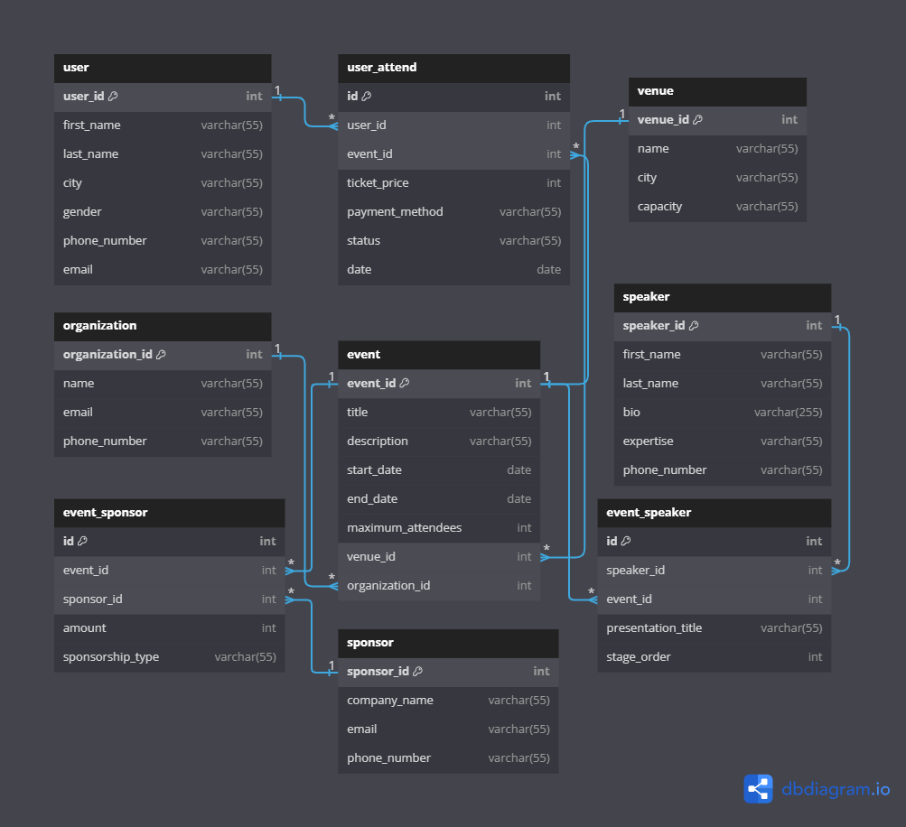

## Problem Statement

## Requirements

### Organizations and Basic Information:

* Organizations are identified by organization_id and store details including name, email and phone number.
* Events have an event_id and also informations like title, description, start date, end date, and maximum attendees.
* Venues are tracked with venue_id, name, city, and their capacity.
* Speakers in the system are given speaker_id and maintain their full name, bio, contact information (email, phone), and area of expertise.
* Sponsoring companies receive sponsor_id and record their company name, contact informations (email, phone).
* Users are given user_id and must provide full name, email, phone number, and city address.

### Relationships and Business Rules:

* Each organization can manage multiple events, while every event must be managed by exactly one organization.
* All events must take place at a single venue, but venues may host numerous events.
* Multiple speakers can participate in any given event. The system should track presentation titles and stage order for every speaker engagement.
* Sponsorship arrangements allow multiple sponsors per event, and sponsors may support multiple events. Sponsorship has different types (Gold, Silver, Bronze).
* Users have the flexibility to attend multiple events, and events can accommodate many attendees. Registration dates and attendance status (accepted or rejected) are maintained for all event attendees.
* Due a financial purpose we need to track each transaction whether it was a tickets or sponsership payments.

## ER Diagram

## Relational Model

[View on dbdiagram.io](https://dbdiagram.io/d/6742223ce9daa85aca7abb35)
